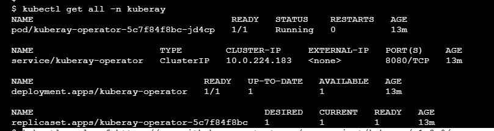

I'm using ray for receiving Workloads in Kubernetes.
Through Ray I can specify jobs requirements like number of workers.
I can configure Ray to delete Cluster after Job is finished.
Workloads can be split trhu workers
I could Also provide Ray clusters for interactive development.
Ray also provide a interface for following jobs, this interface I'm yet to validate.
